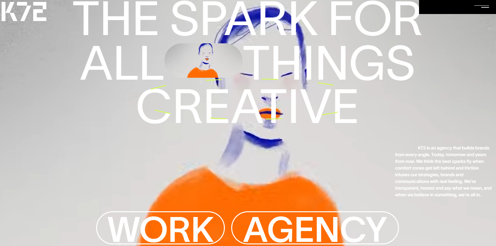

<!-- # K72 Agency — Creative Portfolio

A high-performance creative agency portfolio built with React, featuring smooth scroll animations, scroll-triggered effects, and a custom fake scrollbar system.

🔗 **Live:** https://k72-agency-6qle8z7zq-r32284947-5488s-projects.vercel.app/

---

## Tech Stack

| Layer         | Technology                                   |
| ------------- | -------------------------------------------- |
| Framework     | React 18                                     |
| Bundler       | Vite                                         |
| Routing       | React Router v6                              |
| Animation     | GSAP + ScrollTrigger                         |
| Smooth Scroll | Lenis                                        |
| Styling       | Tailwind CSS                                 |
| Slider        | Swiper.js                                    |
| Compiler      | React Compiler (babel-plugin-react-compiler) |
| Deployment    | Vercel                                       |
| CI/CD         | GitHub Actions                               |

---

## Features

- **Scroll animations** — GSAP ScrollTrigger-driven card reveals and section pins
- **Smooth scrolling** — Lenis with custom RAF loop and keyboard support
- **Custom scrollbar** — Fake scrollbar synced to Lenis scroll position
- **Responsive** — Mobile-first, adapts across all breakpoints
- **Performance** — GPU-composited animations, lazy image loading, passive event listeners
- **Blog** — Filterable blog with category system
- **Multi-language routing** — `/en/` prefixed routes
- **Video sync** — Dual video playback with drift correction

---

## Getting Started

```bash
npm install
npm run dev
```

---

## Project Structure

```
src/
├── components/       # Reusable UI components
├── common/           # Shared utilities and constants
├── pages/            # Route-level page components
├── routes/           # Route definitions and configuration
├── hooks/            # Custom React hooks
├── context/          # React context providers
├── styles/           # Global styles and Tailwind config
└── assets/           # Static assets
```

---

## Performance Highlights

- Animations use `transform` and `opacity` only — zero layout reflow
- `will-change` applied selectively, not globally
- Lenis scroll listener decoupled from React state to prevent re-renders
- Images delivered via **ImageKit CDN** with on-the-fly WebP conversion, resizing, and blur placeholders
- Videos streamed via **Cloudinary CDN** with adaptive delivery; static assets also served through ImageKit
- Responsive `srcSet` with mobile/desktop image variants
- Above-fold images marked `fetchpriority="high"`
- Route-level code splitting with `React.lazy` + `Suspense` — only loads what's needed
- **React Compiler** (`babel-plugin-react-compiler`) handles automatic memoization — no manual `memo`/`useMemo`/`useCallback`
- CSS minified with **cssnano** at build time — removes whitespace, merges rules, and deduplicates declarations -->

<div align="center">


# K72 Agency — Creative Portfolio

A high-performance creative agency portfolio built with React, featuring smooth scroll animations, scroll-triggered effects, and a custom fake scrollbar system.

[](https://k72-agency-6qle8z7zq-r32284947-5488s-projects.vercel.app/)
[](https://github.com/rayan9476/k72-agency)



</div>

🔗 **Live:** https://k72-agency-6qle8z7zq-r32284947-5488s-projects.vercel.app/

---

## Tech Stack

| Layer         | Technology                                   |
| ------------- | -------------------------------------------- |
| Framework     | React 18                                     |
| Bundler       | Vite                                         |
| Routing       | React Router v6                              |
| Animation     | GSAP + ScrollTrigger                         |
| Smooth Scroll | Lenis                                        |
| Styling       | Tailwind CSS                                 |
| Slider        | Swiper.js                                    |
| Compiler      | React Compiler (babel-plugin-react-compiler) |
| Deployment    | Vercel                                       |
| CI/CD         | GitHub Actions                               |

---

## Features

- **Scroll animations** — GSAP ScrollTrigger-driven card reveals and section pins
- **Smooth scrolling** — Lenis with custom RAF loop and keyboard support
- **Custom scrollbar** — Fake scrollbar synced to Lenis scroll position
- **Responsive** — Mobile-first, adapts across all breakpoints
- **Performance** — GPU-composited animations, lazy image loading, passive event listeners
- **Blog** — Filterable blog with category system
- **Multi-language routing** — `/en/` prefixed routes
- **Video sync** — Dual video playback with drift correction

---

## Getting Started

```bash
npm install
npm run dev
```

---

## Project Structure

src/
├── components/ # Reusable UI components
├── common/ # Shared utilities and constants
├── pages/ # Route-level page components
├── routes/ # Route definitions and configuration
├── hooks/ # Custom React hooks
├── context/ # React context providers
├── styles/ # Global styles and Tailwind config
└── assets/ # Static assets

---

## Performance Highlights

- Animations use `transform` and `opacity` only — zero layout reflow
- `will-change` applied selectively, not globally
- Lenis scroll listener decoupled from React state to prevent re-renders
- Images delivered via **ImageKit CDN** with on-the-fly WebP conversion, resizing, and blur placeholders
- Videos streamed via **Cloudinary CDN** with adaptive delivery; static assets also served through ImageKit
- Responsive `srcSet` with mobile/desktop image variants
- Above-fold images marked `fetchpriority="high"`
- Route-level code splitting with `React.lazy` + `Suspense` — only loads what's needed
- **React Compiler** (`babel-plugin-react-compiler`) handles automatic memoization — no manual `memo`/`useMemo`/`useCallback`
- CSS minified with **cssnano** at build time — removes whitespace, merges rules, and deduplicates declarations

---

## Dependencies

### Install all at once

```bash
npm install gsap swiper react-router-dom lenis
```

```bash
npm install -D tailwindcss postcss autoprefixer @vitejs/plugin-react vite babel-plugin-react-compiler cssnano
```

---

## Deployment

### Vercel (Recommended)

```bash
# Option 1 — CLI
npm i -g vercel
vercel

# Option 2 — Connect GitHub repo to vercel.com
# Automatic redeploy on every git push via GitHub Actions CI/CD
```

### Netlify

```bash
npm run build
# Drag & drop the dist/ folder to netlify.com/drop
```

Add `public/_redirects` for React Router to work:

/\* /index.html 200

---

## Browser Support

| Browser       | Support | Notes                    |
| ------------- | ------- | ------------------------ |
| Chrome 90+    | ✅ Full | —                        |
| Firefox 88+   | ✅ Full | —                        |
| Safari 14+    | ✅ Full | —                        |
| Edge 90+      | ✅ Full | —                        |
| Mobile Chrome | ✅ Full | Reduced-motion respected |
| Mobile Safari | ✅ Full | Reduced-motion respected |

---

## Known Issues

- ScrollTrigger pins may briefly recalculate on window resize — refresh triggers on resize end
- Dual video sync can drift slightly on very low-end devices under heavy CPU load
- `/en/` routes assume a single locale for now — full i18n content pipeline not yet wired up

---

## License

This project is a commercial portfolio template. You may:

- ✅ Use for client and personal projects
- ✅ Modify and rebrand freely
- ❌ Resell or redistribute this template itself as a product

---

## 👤 Author

Built by **Rayyan** — Full Stack Developer based in Karachi, Pakistan.

- Fiverr: [fiverr.com/hellorayyan](https://fiverr.com/hellorayyan)
- GitHub: [github.com/rayan9476](https://github.com/rayan9476)
- Email: hellorayyan.dev@gmail.com

---

## Changelog

### v1.0.0 — Initial Release

- GSAP ScrollTrigger-driven card reveals and section pins
- Lenis smooth scroll with custom RAF loop and keyboard support
- Custom fake scrollbar synced to scroll position
- Filterable blog with category system
- Multi-language `/en/` prefixed routing
- Dual video playback with drift correction
- React Compiler automatic memoization
- ImageKit + Cloudinary CDN delivery pipeline
- Route-level code splitting with lazy loading
- Fully responsive — mobile-first across all breakpoints

---

<div align="center">


_Built with React + Vite + Tailwind CSS + GSAP + Lenis + Swiper.js_

</div>
